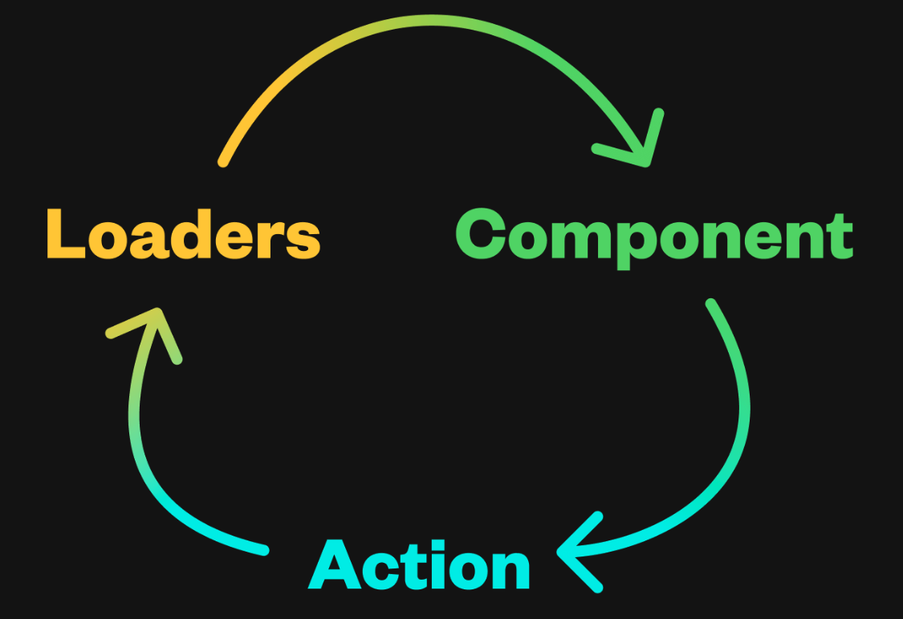
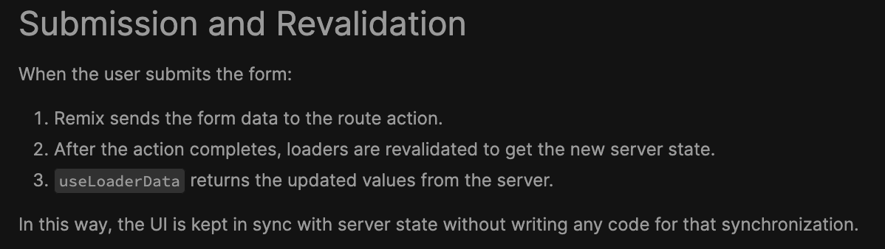

### Fullstack Data Flow



### Caching
- cache headers and a CDN over ISR

### State Management
1. **Network-related State:** If your React state is managing anything related to the network—such as data from loaders, pending form submissions, or navigational states—it's likely that you're managing state that Remix already manages:
    
    - **[`useNavigation`](https://remix.run/docs/en/main/hooks/use-navigation)**: This hook gives you access to `navigation.state` (idle, submitting, loading), `navigation.formData` (POST body), `navigation.location` (next url), `navigation.formAction` (resource/api/module route with action handler), `navigation.formMethod` (GET or POST)
	    - old api is useTransition
    - **[`useFetcher`](https://remix.run/docs/en/main/hooks/use-fetcher)**: `fetcher.Form` (POST sans navigation to a resource route), 
    - **[`useLoaderData`](https://remix.run/docs/en/main/hooks/use-loader-data)**: Access the data for a route.
    - **[`useActionData`](https://remix.run/docs/en/main/hooks/use-action-data)**: errors from the form 
```ts
const { errors } = useActionData<typeof action>();
```


### Remix V2 Upgrade
#### Deprecation of useTransition Hook
> Old API
```ts
import { useTransition } from "@remix-run/react"; 

function SomeComponent() { 
	const transition = useTransition(); 
	transition.submission.formData;
	transition.submission.formMethod; 
	transition.submission.formAction; 
	transition.type; 
}
```

> New API

```ts
import { useNavigation } from "@remix-run/react";

function SomeComponent() {
  const navigation = useNavigation();
  // transition.submission keys are flattened onto `navigation[key]`
  navigation.formData;
  navigation.formMethod;
  navigation.formAction;
  // this key is removed
  navigation.type;
}
```

