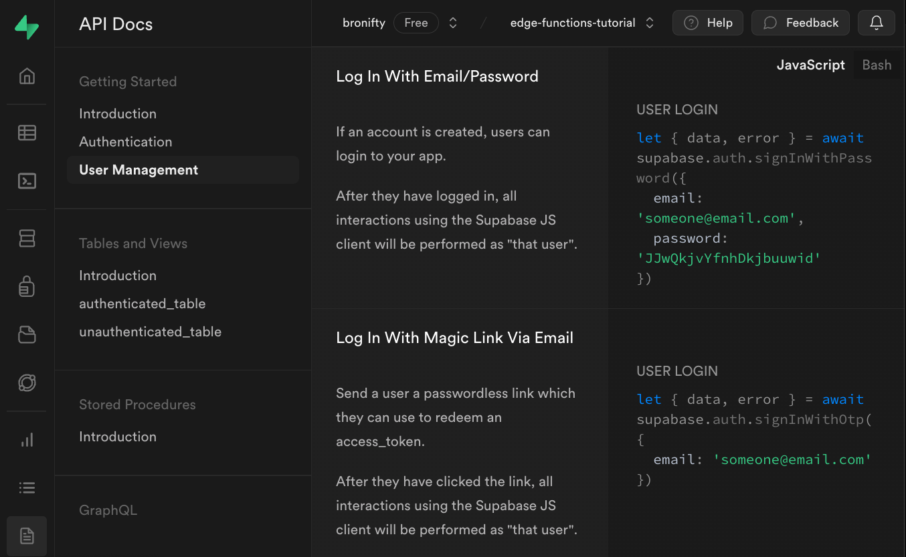
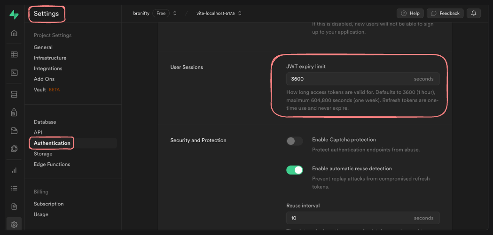

1. Auth Strategy & User Management
Yes hello, I'd be happy to help you with this. You can switch to OTP with magic link (passwordless) authentication by updating your supabase-js client api call. Existing users will be managed transparently by the email provider using the new strategy. There is no need to look up their passcode in the database to find them. The supabase-js client will find them by their id, linking them through the email they provide and create a JWT session with their user key in local storage. To your question "Is there perhaps some utility function we can use to encrypt passwords before searching for them in the database?": yes a library like crypto or bcrypt allows you to do this, but it won't be necessary and is not supported by Supabase.

Here is an example of the client - supabase-js - call to the auth api before and after the OTP / passwordless strategy update.

- email and password strategy
```js
let { data, error } = await supabase.auth.signInWithPassword({
  email: 'someone@email.com',
  password: 'JJwQkjvYfnhDkjbuuwid'
})
```
- OTP (magic link) strategy
```js
let { data, error } = await supabase.auth.signInWithOtp({
  email: 'someone@email.com'
})
```

You'll find more info specific to your project in the dashboard API Docs section


- Also, I have put together a repo with a site you can try logging into to get an idea of how to put this together for your own project.
- [github](https://github.com/bronifty/supabase-support2)
- [website](https://supabase.tech-support.bronifty.xyz)
	- /signUpWithEmailPassword
	- /signInWithEmailPassword
	- /signInWithOTPEmail

> > GOTCHA: fyi signing up with password then logging in with either password or OTP works, but logging in (and confirming email) with OTP originally then trying to add a password does not work without manual intervention with an update to the user.

-----------
2. JWT and Session
Yes hello, I'd be happy to help you with this. You are correct supabase-js saves the JWT in localStorage and the expiry is 3600 seconds (an hour) by default. You can change this in the dashboard project Settings > Authentication > JWT expiry limit. I hope this helps. Please let me know if you have any other questions. Thanks.



----------
3. CORS Error in Edge Functions
Hi Adam, I'd be happy to help you with this. There can be any number of issues with cors related to browser queries of endpoints generally. “has been blocked by cors policy no 'access-control-allow-origin' header is present on the request” is specific to this header: "Access-Control-Allow-Origin", which you set on the server to allow clients from any or a specific origin; it's similar to an ingress rule in networking in that both access control allow origin and ingress rules deal with inbound traffic to the server.

Here is a header which grants that where * can be replaced with a specific origin (client is origin of request to server)
export const corsHeaders = {
  'Access-Control-Allow-Origin': " * "
  'Access-Control-Allow-Headers': 'authorization, x-client-info, apikey, content-type',
}

You may also get cors errors when working locally with the edge functions. This will be specific to the server being blocked by the client (the opposite of the error you mentioned above). In that case, the cors error is related to the security of the server per se (it needs a TLS/SSL endpoint). 

Here is a repo with a walkthrough (check the README for Edge Functions item 3) of setting up the functions locally and handling the cors error (both with your error resolved by controlling the access control allow origin header as well as the server related one due to SSL/TLS):  [supabase-support2](https://github.com/bronifty/supabase-support2.git) 

Also here is the Supabase documentation pointing to some more troubleshooting. Please give this a try / read and let me know if you have further questions. Thanks.
- [supabase docs edge function troubleshooting](https://supabase.com/docs/guides/functions/troubleshooting)
- [cors issue supabase edge function example](https://github.com/supabase/supabase/blob/master/examples/edge-functions/supabase/functions/browser-with-cors/index.ts)

---------
4. Query Performance 
Hi Michel, I'd be happy to help you with this. In order to deal with your offending queries in the most expeditious manner possible, I recommend changing the default timeout in order to fix your timeout error. Once that's done, you can look into improving the performance of your queries. 

Please refer to the documentation on [postgres config](https://supabase.com/docs/guides/database/postgres/configuration) to see the most up-to-date methodologies for handling standard issues. 

Once this is complete, please let me know if this is working for you and we can look further into some strategies for improving the perf of your queries such as continuing with the indexing, and look into partitions, caching and some other things...

--------

"By default, Supabase limits the maximum statement execution time to _8 seconds_ for users accessing the API. Additionally, all users are subject to a global limit of _2 minutes_. 
### Changing the default timeout[#](https://supabase.com/docs/guides/database/postgres/configuration#changing-the-default-timeout)

The timeout values were picked as a reasonable default for the majority of use-cases, but can be modified using the [`alter role`](https://www.postgresql.org/docs/current/sql-alterrole.html) statement:

```sql
-- For API users
alter role authenticator set statement_timeout = '15s';
```
You can also update the statement timeout for a session:
```sql
set statement_timeout to 60000; -- 1 minute in milliseconds
```
### Statement Optimization[#](https://supabase.com/docs/guides/database/postgres/configuration#statement-optimization)

All Supabase projects

All Supabase projects come with the [`pg_stat_statements`](https://www.postgresql.org/docs/current/pgstatstatements.html) extension installed, which tracks planning and execution statistics for all statements executed against it. These statistics can be used in order to diagnose the performance of your project.

This data can further be used in conjunction with the [`explain`](https://www.postgresql.org/docs/current/using-explain.html) functionality of Postgres to optimize your usage."

--------
